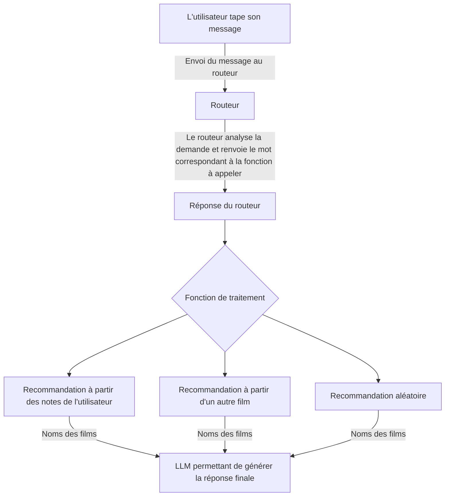

# 🎬 LLMovie

## 🧠 Objectif du projet

Ce projet a pour but de **développer un système de recommandation de films fonctionnant entièrement en local**, sans appel à une API externe ni stockage cloud.  
Il repose sur des **techniques de filtrage collaboratif**, d’analyse de notes utilisateurs et de **réduction de dimension** (via *Truncated SVD*).  

Le but est de pouvoir recommander des films :
-  à partir des préférences d’un utilisateur (basées sur ses notations),
-  à partir d’un film donné (trouver les films les plus similaires),
-  ou donner un film aléatoire.

---

⚠️ Cette version est seulement une V1, des améliorations possibles pourrait notamment être:
- Rendre la pipeline plus rapide
- Ajouter un système de RAG pour accéler également le processus

---

## 📦 Installation des données

### 1️⃣ Télécharger le dataset MovieLens

Ce projet s’appuie sur le jeu de données [**MovieLens**](https://grouplens.org/datasets/movielens/latest/).  

Ce dataset contient :
- 33,000,000 notes d'utilisateurs 
- 86,000 films 
- 330,975 utilisateurs.

Les derniers ajouts dans ce dataset date du 09/2018. Les films les plus récents datent de 2024. 

Exemple :  
Télécharge le fichier `ml-latest-small.zip` (ou `ml-latest.zip` pour la version complète).

### 2️⃣ Préparer la structure du projet

Crée un dossier `dataset/` à la racine du projet :

```css
📁 /
┣ 📁 dataset/
┃ ┣ ratings.csv
┃ ┣ movies.csv
┃ ┗ ...
┣ main.py
┣ README.md
┗ requirements.txt
```


Place les fichiers du dataset MovieLens (ex. `ratings.csv`, `movies.csv`) dans ce dossier.

---

### 3️⃣ (Optionnel) Ajouter ton profil Letterboxd

Pour une recommandation plus spécifique tu peux ajouter **tes données Letterboxd** :

1. Va sur ton profil Letterboxd (ex : `https://letterboxd.com/ton_nom/`).
2. Clique sur `Settings` → `Import & Export`.
3. Clique sur **"Export Your Data"** pour télécharger ton fichier `.zip`.
4. Met le `.zip` dans le dossier `dataset/`.

Ainsi Le projet peut ainsi utiliser ton propre historique de films pour produire des recommandations personnalisées.

---

## ⚙️ Fonctionnement du projet

Ce projet s’exécute **entièrement en local** :  
Aucune requête externe n’est envoyée.  
Les calculs et les recommandations sont faits directement sur l'ordinateur, à partir des fichiers CSV présents dans `dataset/`.

Il sera cependant nécessaire d'avoir Ollama d'installer sur ton ordinateur avec le modèle suivant :
- gemma:7b

```bash
ollama pull gemma:7b
```

### 🧩 Pipeline générale



---

## 🧮 Méthodes de recommandation

Le système utilise trois approches complémentaires :

### 1️⃣ Recommandation basée sur un utilisateur

Tout d'abord on cherche à calculer le bias utilisateurs et le biais des films

Biais film:

$$
b_i = \frac{\sum_{u \in U_i} (r_{ui} - \mu)}{|U_i| + \lambda} 
$$

Biais utilisateur:

$$
b_u = \frac{\sum_{i \in I_u} (r_{ui} - \mu - b_i)}{|I_u| + \lambda} 
$$

avec:

$$
r_{ui} : la\ note\ donnée\ par\ l’utilisateur\ u\ au\ film\ i
$$
$$
\mu : moyenne\ globale\  de\ toute\ les\ notes
$$
$$
U_i: ensemble\ des\ utilisateurs\ ayant\ noté\ le\ film\ i
$$
$$
I_u : ensemble\ des\ films\ notés\ par\ l’utilisateur\ u 
$$
$$
\lambda : terme\ de\ régularisation
$$

Par la suite on calcule le residuals

$$
r'_{ui} = r_{ui} - (\mu + b_u + b_i)
$$

avec:

$$
r_{ui} : la\ note\ donnée\ par\ l’utilisateur\ u\ au\ film\ i
$$
$$
\mu : moyenne\ globale\  de\ toutes\ les\ notes
$$
$$
b_u : biais\ utilisateur
$$
$$
b_i : biais\ film
$$

Cette formule permet de mettre à jour la note en prenant en compte le biais précédemment calculé.

Par la suite, on construit une matrice avec les utilisateurs et les films. Plus précisément, on utilise TruncatedSVD. On pourra utiliser les vecteurs latents pour prédire la note d’un film. 

$$
\hat{r}_{ui} = \mu + b_u + b_i + \mathbf{u}_i \cdot \mathbf{v}_j
$$

avec:

$$
\mathbf{u}_{i} : vecteur\ latent\ utilisateur
$$
$$
\mathbf{v}_{j} : vecteur\ latent\ film
$$


Il ne restera plus qu’à utiliser cette prédiction pour ressortir les k films avec la meilleure note prédite.

---

### 2️⃣ Recommandation basée sur un film (item-item)

On gardera seulement les films avec une note supérieure a 4,0.

Pour chaque film, on calcule combien d'utilisateurs ont noté ce film et quelle est la note moyenne parmi eux.

Ensuite on calcule simplement la moyenne pondérée:

$$
score_i = mean\_rating_i \times \frac{count_i}{\max_j(count_j)}
$$

Il ne restera plus qu’à ressortir les k films avec la meilleure moyenne.

---

### 3️⃣​ Recommandation aléatoire

Pour cette recommandation on demande seulement au LLM de nous recommander un film.

---

## 🚀 Exécution

Pour lancer le programme il suffit de faire la commande suivante :

```bash
python main.py
```
